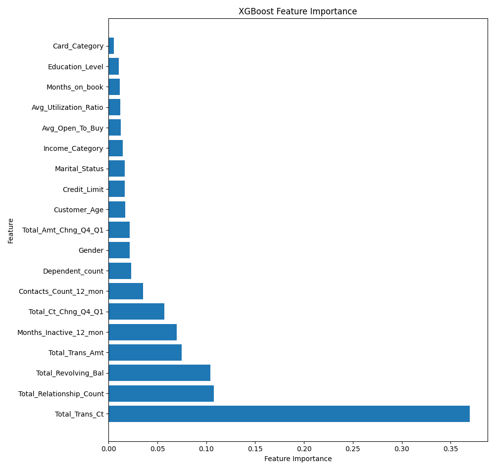
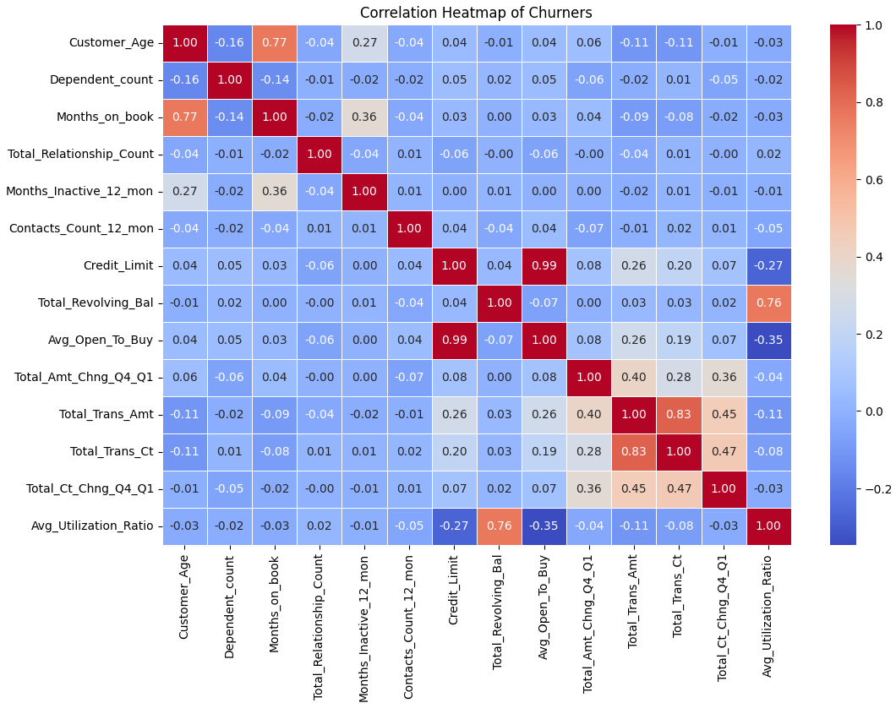

# Credit Card Costumer Churn Analysis and Prediction
[](https://www.python.org/)
[](https://numpy.org/)
[](https://pandas.pydata.org/)
[](https://matplotlib.org/)
[](https://scikit-learn.org/)
[](https://seaborn.pydata.org/)

## 📝 Description 
This project aims to predict customer churn for a financial institution using machine learning models. The dataset used for this project is the "Credit Card Customers" dataset available on Kaggle. The primary objectives include building classification and clustering models, selecting appropriate performance metrics, tuning model parameters, and describing the results from unsupervised learning.


## 📦 Repo structure

    CUSTOMER_CHURN_ANALYSIS/
    ├── .gitignore
    ├── Readme.md
    ├── requirements.txt
    ├── classification_models/
    │   ├── decision_tree_classifier.pkl.gz
    │   ├── knn_classifier.pkl.gz
    │   ├── naive_bayes_classifier.pkl.gz
    │   ├── random_forest_classifier.pkl.gz
    │   └── xgboost_classifier.pkl.gz
    ├── data/
    │   ├── BankChurners.csv
    │   └── NewClients.csv
    ├── Feature_names/
    │   ├── encoded_feature_names.csv
    │   └── original_feature_names.csv
    ├── images/
    │   └── tree1.png
    ├── output/
    │   └── feature_importance_plot.png
    ├── Preprocess_models/
    │   ├── encoder.pkl.gz
    │   ├── imputer_cat.pkl.gz
    │   ├── imputer_num.pkl.gz
    │   ├── scaler.pkl.gz
    │   └── standardizer.pkl.gz
    └── src/
        ├── __init__.py
        ├── churn_prediction.py
        ├── classifiers.py
        ├── preprocessing.py
        └── notebook/
            ├── __init__.py
            ├── 01-EDA.ipynb
            ├── 02-exploring_clustering.ipynb


## ⚙️ Installation

To get started with Churn Prediction, follow these simple steps:

1. Clone the repository:
    ```bash
    git clone https://github.com/ArianaBik96/churn-prediction.git
    ```

2. Navigate to the project directory:
    ```bash
    cd classifiers.py
    ```

3. Install Dependencies:
    - Make sure you have Python 3.12 installed on your system.
    - Install the required dependencies using pip:
    ```bash
    pip install -r requirements.txt
    ```

You're all set! You can now preprocess the data using preprocessing_data.py, train your classification model using train_classification_model.py, train your clustering model using train_clustering_model.py, and explore the data in the data directory. Enjoy!

## 📂 Data Source
The dataset used for this project can be found on [Kaggle](https://www.kaggle.com/datasets/sakshigoyal7/credit-card-customers).

## 📊 Conclusion

#### 🎯 Important features 



- **Total_Trans_Ct**: The total number of transactions made by the customer.
- **Total_Relationship_Count**: The total number of products held by the customer.
- **Total_Revolving_Bal**: The total revolving balance on the credit card.
- **Total_Trans_Amt**: The total transaction amount.
- **Months_Inactive_12_Mon**: The number of months inactive in the last 12 months.
- **Total_Ct_Chng_Q4_Q1**: The change in the total transaction count from quarter 4 to quarter 1.

#### 🔗 Correlations


- **Total_Trans_Amt and Total_Trans_Ct**: Customers who make more transactions tend to spend more money.
- **Months_on_Book and Customer_Age**: Customers who have been with the bank for a longer time tend to be older.
- **Credit_Limit and Avg_Open_To_Buy**: Customers are making a high number of transactions but with relatively low amounts.
- **Avg_Utilization_Ratio and Total_Revolving_Bal**: Customers with higher revolving balances tend to have a higher utilization ratio. This could signal financial stress or inability to pay off debts, leading to churn as customers seek better financial solutions elsewhere.

#### 🚨 Profile of Customers Most Likely to Churn
- **Younger Customers:** Those who are relatively younger may be more prone to churn, possibly due to evolving needs or less brand loyalty.
- **Moderate Credit Users:** Customers who operate close to their credit limit and have a moderate utilization ratio. This suggests a segment potentially facing financial strain or seeking better financial options.
- **Moderate Transaction Users with Low Total Amounts:** Attrited customers tend to engage in a moderate number of transactions but with relatively low total transaction amounts. This indicates dissatisfaction with the value they receive from the company's offerings.
- **Lower Revolving Balances:** Churned customers tend to have lower revolving balances, implying that even those managing their credit responsibly may churn due to factors beyond financial metrics.
- **Possibly Dissatisfied Customers:** Overall, churned customers may include those dissatisfied with the value proposition offered by the company, regardless of their financial behavior.

## ⏱️ Timeline
This project took 5 days for completion.

## 📌 Personal Situation
This project was done as part of the AI Bootcamp at BeCode.org.